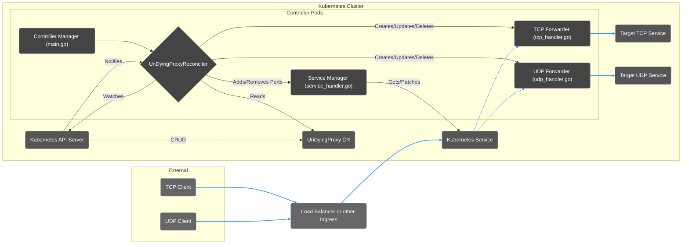

# UnDyingProxy: A UDP and TCP forwarder for Kubernetes
---

[](https://opensource.org/licenses/Apache-2.0)
[](https://golang.org/dl/)
[](https://goreportcard.com/report/github.com/snarlysodboxer/undying-proxy)

**UnDyingProxy redirects TCP and UDP traffic from a single external IP to internal Kubernetes services across namespaces, significantly reducing cloud load balancer costs and simplifying ingress.**

## Why UnDyingProxy?

Cloud load balancers are powerful but can become expensive, especially when you need to expose numerous services (like game servers, databases, or IoT endpoints) each in it's own namespace and requiring its own port. UnDyingProxy offers a cost-effective alternative by allowing you to:

*   **Multiplex Ports:** Forward traffic from many source ports on a single external IP to different internal services and ports.
*   **Reduce Cloud Costs:** Pay for potentially only one cloud load balancer (or even none!) instead of many.
*   **Simplify Ingress:** Manage TCP/UDP forwarding declaratively using Kubernetes custom resources.
*   **Achieve High Availability:** Run multiple replicas of the proxy for resilience.

Each `UnDyingProxy` object specifies one listen port and one target host and port to forward to each for TCP and UDP.

This supports only paying for one Loadbalancer, or even avoiding a cloud Loadbalancer altogether by running as a DaemonSet on nodes with direct public IPs. If using a cloud Loadbalancer, this operator can automatically add/remove `Ports` in a `Service` object as `UnDyingProxy` objects are created/destroyed, to open/close the ports in the Loadbalancer.

## ✨ Features

*   **TCP & UDP Forwarding:** Configure forwarding rules for both protocols independently per `UnDyingProxy` resource.
*   **Dynamic Configuration:** Define forwarding rules using the `UnDyingProxy` Custom Resource Definition (CRD). Changes are automatically detected and applied.
*   **Automatic Service Port Management (Optional):** Automatically update Kubernetes `Service` ports (e.g., for LoadBalancer Services) as `UnDyingProxy` resources are created/deleted.
*   **High Availability:** Designed to run with multiple replicas behind a Kubernetes Service; leader election is disabled.
*   **Prometheus Metrics:** Exposes detailed metrics for monitoring traffic and operator health.
*   **Configurable Timeouts & Buffers:** Fine-tune UDP connection handling.

## Example Use Case

- Forward both UDP and TCP from external port `27015` to the same port on an internal Kubernetes Service in a different namespace. 

```yaml
---
apiVersion: proxy.sfact.io/v1alpha1
kind: UnDyingProxy
metadata:
  name: game-server-1001
  namespace: undying-proxy # Must match operator's namespace
spec:
  udp:
    listenPort: 27015 # External port on the proxy's IP
    targetPort: 27015 # Internal port of the game server pod/service
    targetHost: my-game-server-1001.game-ns.svc.cluster.local
  tcp:
    listenPort: 27015
    targetPort: 27015
    targetHost: my-game-server-1001.game-ns.svc.cluster.local
spec:
  tcp:
```

UnDyingProxy can also be run as a DaemonSet along with round robin DNS to point a domain to your node IPs, and potentially avoid a cloud Loadbalancer altogether. This requires clients to connect directly to node IPs.
## Description

UnDyingProxy listens for TCP and UDP connections on designated ports defined in `UnDyingProxy` custom resources, and forwards packets to the specified destination addresses and ports. This operator works like the NGINX Ingress Controller in that it does the actual forwarding itself, rather than operating external resources. Therefore, it should be run as multiple replicas to provide high availability.

The `--operator-namespace` flag must be set, as this is a namespaced operator. The operator will only watch for `UnDyingProxy` objects in the namespace specified by this flag.

Run one set of replicas of this operator per IP you need to listen upon.

Use `config/manager` as example configs to customize your deployment.

## Architecture

The operator watches for UnDyingProxy objects in the namespace specified by the `--operator-namespace` flag. When an UnDyingProxy object is created, the operator will start new goroutines listening on the specified ports for TCP and UDP traffic. When an UnDyingProxy object is deleted, the operator will shutdown those goroutines, and stop listening on the specified ports, and optionally edit Kubernetes Service objects to control cloud load balancers.



When running multiple replicas, the operator pods sit behind the Kubernetes `Service` resources defined in `config/manager/service.undying-proxy-tcp.yaml` and `config/manager/service.undying-proxy-udp.yaml`. These services are typically of type `LoadBalancer`. The cloud provider's load balancer distributes incoming traffic across the available operator pods. All operator replicas watch for `UnDyingProxy` objects in the configured `--operator-namespace` and maintain their own listeners independently.

## Service Port Management (Optional)

To facilitate integration with cloud load balancers, the operator can optionally manage the `ports` section of designated Kubernetes `Service` objects. This is controlled by the `--tcp-service-to-manage` and `--udp-service-to-manage` flags.

When an `UnDyingProxy` object is created with a TCP or UDP listener, if the corresponding flag is set, the operator will add (or update) a `ServicePort` entry in the specified Service. The entry's `name` will match the `UnDyingProxy` object's name, and the `port` and `targetPort` will match the `listenPort` from the `UnDyingProxy`. When the `UnDyingProxy` is deleted, the corresponding `ServicePort` entry is removed.

**Prerequisites:**
- The `Service` object specified by the flag must already exist in the same namespace as the operator.
- The operator needs RBAC permissions to `get`, `patch`, and `update` `Services` in its namespace (these are included in the default manifests).

**GitOps Considerations:**
If you enable this feature and use a GitOps tool like Argo CD or Flux to manage the `Service` object, you **must** configure the tool to ignore differences in the `.spec.ports` field of the managed Service(s). Otherwise, the GitOps tool will continuously revert the changes made by the operator.

## Configuration

The operator is configured primarily through the `UnDyingProxy` Custom Resource Definition (CRD).

### UnDyingProxy Spec

Each `UnDyingProxy` object can define TCP and/or UDP forwarders via the `.spec` field:

- `spec.tcp`: Defines configuration for a TCP forwarder.
    - `listenPort` (Required, integer): The port the operator will listen on for incoming TCP connections.
    - `targetPort` (Required, integer): The destination port on the target host to forward TCP connections to.
    - `targetHost` (Required, string): The destination hostname (DNS resolvable) or IP address to forward TCP connections to.
- `spec.udp`: Defines configuration for a UDP forwarder.
    - `listenPort` (Required, integer): The port the operator will listen on for incoming UDP packets.
    - `targetPort` (Required, integer): The destination port on the target host to forward UDP packets to.
    - `targetHost` (Required, string): The destination hostname (DNS resolvable) or IP address to forward UDP packets to.
    - `readTimeoutSeconds` (Optional, integer): The timeout in seconds for reading UDP packets from both the client and the target connection. Defaults to `30` seconds.
    - `writeTimeoutSeconds` (Optional, integer): The timeout in seconds for writing UDP packets to both the client and the target connection. Defaults to `5` seconds.

*Note: Currently, changes to the `spec` of an existing `UnDyingProxy` object after creation are not fully supported and may require deleting and recreating the object.* // TODO: Add this note or remove when mutability is supported

### Manager Flags

The operator's behavior can be further customized via command-line flags passed to the manager binary:

- `--operator-namespace` (Required, string): The Kubernetes namespace the operator should watch for `UnDyingProxy` objects. The operator is restricted to this single namespace.
- `--tcp-service-to-manage` (Optional, string, default: `undying-proxy-tcp`): The name of a pre-existing Kubernetes `Service` object (in the same namespace as the operator) whose `ports` section will be managed for TCP `listenPort`s defined in `UnDyingProxy` objects. Set to `""` to disable this feature.
- `--udp-service-to-manage` (Optional, string, default: `undying-proxy-udp`): The name of a pre-existing Kubernetes `Service` object (in the same namespace as the operator) whose `ports` section will be managed for UDP `listenPort`s defined in `UnDyingProxy` objects. Set to `""` to disable this feature.
- `--udp-buffer-bytes` (Optional, integer, default: `1024`): The size of the buffer in bytes used for reading and writing UDP packets.
- `--metrics-bind-address` (Optional, string, default: `:8080`): The address the metrics endpoint binds to. Use `:8443` for HTTPS, `:8080` for HTTP. See also `--metrics-secure`.
- `--metrics-secure` (Optional, boolean, default: `false`): If `true`, serve metrics via HTTPS. Requires certificates (can be self-signed).
- `--metrics-authed` (Optional, boolean, default: `false`): If `true`, protect the metrics endpoint with Kubernetes token review and subject access review. Requires corresponding RBAC setup. See the kubebuilder project for more information.
- `--health-probe-bind-address` (Optional, string, default: `:8081`): The address the health probe endpoints (`/healthz`, `/readyz`) bind to.
- `--zap-devel` (Optional, boolean, default: `false`): Enable development mode logging (more verbose, human-readable).
- `--zap-stacktrace-level` (Optional, string, default: `panic`): The minimum log level (`info`, `error`, `panic`) at which to include stack traces.

## Metrics

The operator exposes Prometheus metrics for monitoring its status and the traffic being forwarded.

### Enabling Metrics

Metrics scraping is enabled via the manager flags:
- `--metrics-bind-address`: Set to a non-zero value like `:8080` (HTTP) or `:8443` (HTTPS).
- `--metrics-secure`: Use `true` for HTTPS.
- `--metrics-authed`: Use `true` to require authentication/authorization.

See the `Manager Flags` section above for more details on these flags.

The `config/prometheus` directory contains an example `ServiceMonitor` resource for Prometheus Operator integration. Note that the default ServiceMonitor configuration assumes metrics are served over HTTPS (`:8443`) and may require adjustments based on your chosen flags and security configuration (e.g., setting `insecureSkipVerify: true` for self-signed certificates, or providing CA details).

### Key Metrics

- `undying_proxy_tcp_forwarders` (Gauge): Number of TCP forwarders currently running.
- `undying_proxy_tcp_from_clients_to_target_bytes_total` (CounterVec): Total TCP bytes forwarded from clients to the target, labeled by `forwarder` (UnDyingProxy name).
- `undying_proxy_tcp_from_target_to_clients_bytes_total` (CounterVec): Total TCP bytes forwarded from the target back to clients, labeled by `forwarder`.
- `undying_proxy_tcp_forwarding_errors_total` (CounterVec): Total TCP networking-related errors, labeled by `type` (e.g., `Accept`, `DialServerTarget`, `CopyClientToTarget`, `CopyTargetToClient`).
- `undying_proxy_udp_forwarders` (Gauge): Number of UDP forwarders currently running.
- `undying_proxy_udp_clients_connected` (GaugeVec): Number of UDP clients currently connected, labeled by `forwarder`.
- `undying_proxy_udp_from_clients_to_target_bytes_total` (CounterVec): Total UDP bytes forwarded from clients to the target, labeled by `forwarder`.
- `undying_proxy_udp_from_target_to_clients_bytes_total` (CounterVec): Total UDP bytes forwarded from the target back to clients, labeled by `forwarder`.
- `undying_proxy_udp_forwarding_errors_total` (CounterVec): Total UDP networking-related errors, labeled by `type` (e.g., `ResolveListenAddress`, `ResolveTargetAddress`, `Listen`, `DialUDPTarget`, `WriteToTarget`, `ReadFromClient`, `ReadFromTarget`, `WriteToClient`).
- `undying_proxy_operator_errors_total` (CounterVec): Total internal operator errors, labeled by `type` (e.g., `FailedSetupTCPForwarder`, `FailedSetupUDPForwarder`, `FailedFetch`, `FailedUpdateStatus`, `FailedRemoveFinalizer`, `FailedAddFinalizer`, `FailedServiceCleanup`, `FailedManageTCPService`, `FailedManageUDPService`).

## TODOs

- Support one operator for UnDyingProxies from many namespaces.
- Support an annotation to set which instance of the operator will handle a given UnDyingProxy, which will allow for more than one operator in the same namespace.

## Getting Started

### Prerequisites

- Go version v1.22.0+
- Docker version 17.03+.
- kubectl version v1.11.3+.
- Access to a Kubernetes v1.11.3+ cluster.

### To Deploy on a cluster

**Build and push an image somewhere:**

```sh
make docker-build docker-push IMG=<some-registry>/undying-proxy:tag
```

**Install the CRDs into the cluster:**

```sh
make install
```

**Deploy the Manager to the cluster with the image specified by `IMG`:**

```sh
make deploy IMG=<some-registry>/undying-proxy:tag
```

**Create instances of your solution:**
You can apply the samples (examples) from the config/sample:

```sh
kubectl apply -k config/samples/
```

### To Uninstall

**Delete the instances (CRs) from the cluster:**

```sh
kubectl delete -k config/samples/
```

**Delete the APIs (CRDs) from the cluster:**

```sh
make uninstall
```

**Undeploy the controller from the cluster:**

```sh
make undeploy
```

## Contributing

Contributions are welcome! Please create an issue first to discuss the proposed changes.

When submitting a pull request, please ensure you have:

- Run `make lint` and addressed any linting errors.
- Run `make manifests` to ensure generated code and manifests are up to date.
- Run `make test` and `make test-e2e` to ensure tests pass.

**NOTE:** Run `make help` for more information on all potential `make` targets.

More information can be found via the [Kubebuilder Documentation](https://book.kubebuilder.io/introduction.html).

Note the following test commands:

- `make test`
  - Runs the unit tests.
- `make test-e2e`
  - Runs the end to end tests against an existing kubectl context named `kind-undying-proxy-test`
    - Tests are destructive. A check ensures you are connected to the correct context.
    - An easy way to create the cluster and context is with [kind](https://kind.sigs.k8s.io/docs/user/quick-start/#installing-with-a-package-manager): `kind create cluster --name undying-proxy-test`

## License

Copyright 2024 david amick.

Licensed under the Apache License, Version 2.0 (the "License");
you may not use this file except in compliance with the License.
You may obtain a copy of the License at

    http://www.apache.org/licenses/LICENSE-2.0

Unless required by applicable law or agreed to in writing, software
distributed under the License is distributed on an "AS IS" BASIS,
WITHOUT WARRANTIES OR CONDITIONS OF ANY KIND, either express or implied.
See the License for the specific language governing permissions and
limitations under the License.
